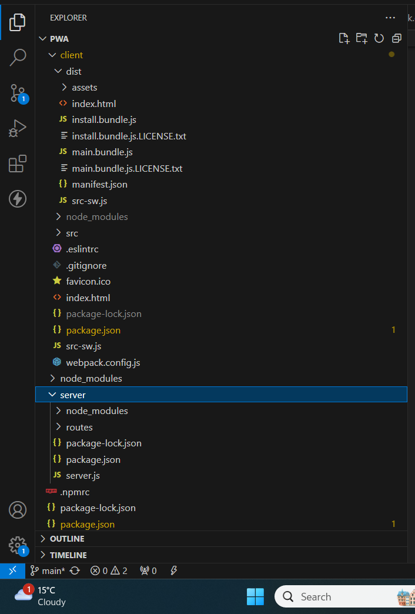
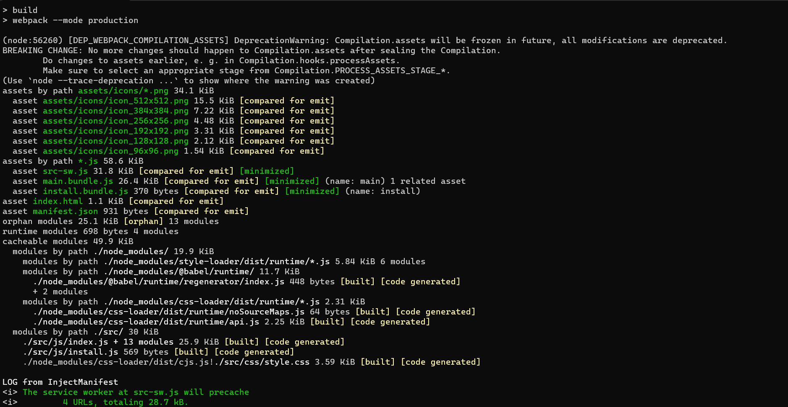
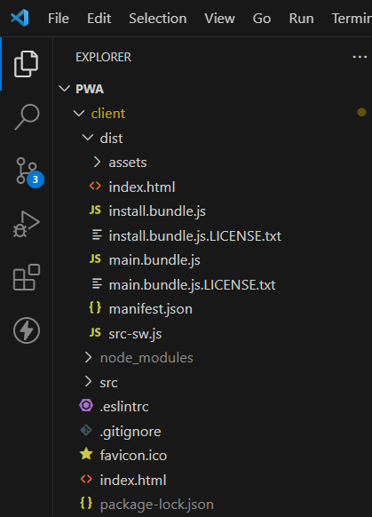
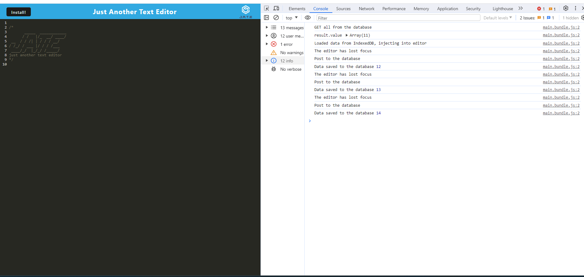
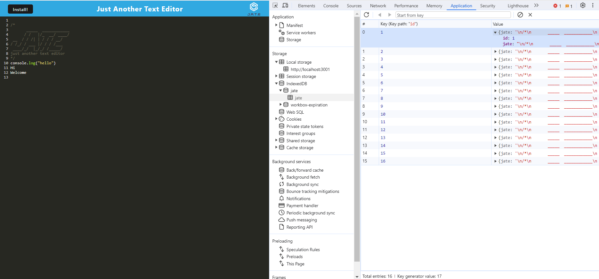
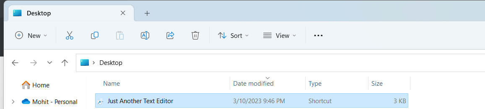
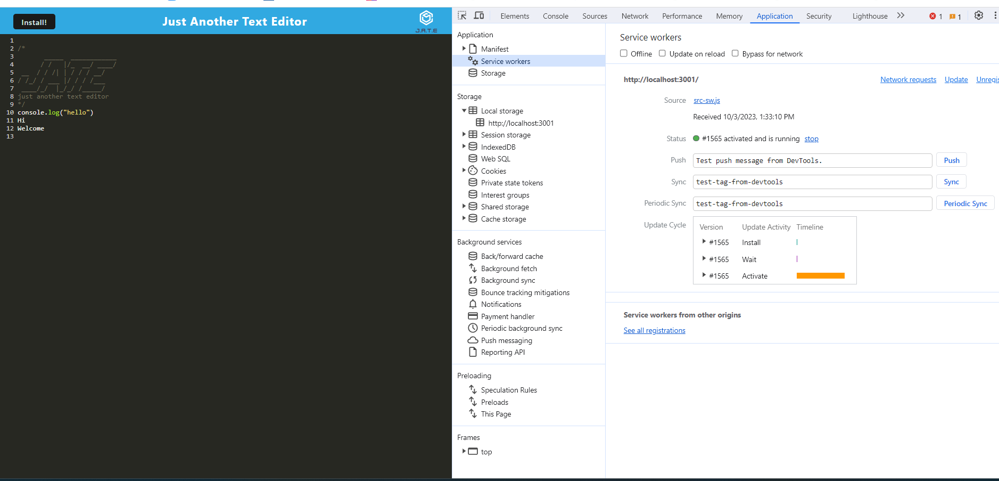
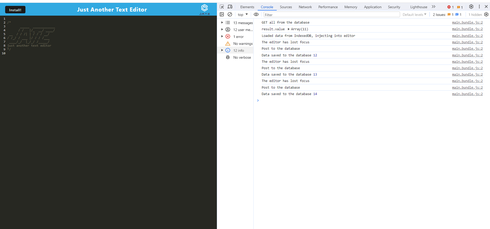

# pwa

# Description

This progressive web appliccation is based on service worker that means application will work with internet and as well without internet. It allows the user to visit the app if it is offline . And also includes indexDB for you to stoe data inside a user's browser.because it lets you create web applications with rich query abilities regardless of network availability, your applications can work both online and offline

This project has been deployed to GitHub Pages. To get this project up and running, you can follow the deployment link. Or, download the sources files to use this as a template.
URL of GitHub Repo:https://github.com/LipikaManglaa/pwa.git

git@github.com:LipikaManglaa/pwa.git

This application has been deployed to Heroku and Url Link is:

## Table of Contents

  
* [Description](#Description)

* [Screenshots](#Screenshots) 

* [Technologies-Used](#Technologies-Used)

* [Features](#Features)   

* [Installation](#installation)
  
* [Instructions](#Instructions) 
          
* [Questions](#questions)

* [License](#license)  

### Features

        GIVEN a text editor web application
        WHEN I open my application in my editor
        THEN I should see a client server folder structure

 

        WHEN I run `npm run start` from the root directory
        THEN I find that my application should start up the backend and serve the client
        WHEN I run the text editor application from my terminal`

  

        THEN I find that my JavaScript files have been bundled using webpack
        WHEN I run my webpack plugins
        THEN I find that I have a generated HTML file, service worker, and a manifest file

  

        WHEN I use next-gen JavaScript in my application
        THEN I find that the text editor still functions in the browser without errors
        WHEN I open the text editor

        THEN I find that IndexedDB has immediately created a database storage
        WHEN I enter content and subsequently click off of the DOM window
        THEN I find that the content in the text editor has been saved with IndexedDB
        WHEN I reopen the text editor after closing it
        THEN I find that the content in the text editor has been retrieved from our IndexedDB

        WHEN I click on the Install button
        THEN I download my web application as an icon on my desktop

        WHEN I load my web application
        THEN I should have a registered service worker using workbox
        WHEN I register a service worker

THEN I should have my static assets pre cached upon loading along with subsequent pages and static assets
WHEN I deploy to Heroku
THEN I should have proper build scripts for a webpack application

### Technologies-Used
  * Express.js
  *  babel-loader
  *  css-loader
  *  html-webpack-plugin
  *  http-server
  *  style-loader
  *  webpack
  *  webpack-cli
  *  webpack-dev-server
  *  webpack-pwa-manifest
  *  workbox-webpack-plugin
  *  idb

### Installing

* To install this code, download the zip file, or use GitHub's guidelines to clone the repository. 

* To install dependiencs,run command npm i

## Instructions
If you would like to see how to create this aplication then you can check my github repo and let you know  how to cretae it

## License
This application is covered under the MIT license

## Questions
Created by: LipikaManglaa

If you have any further questions please feel free to contact me at lipika.mangla.web@gmail.com